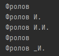
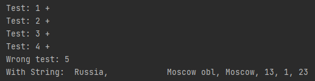
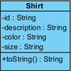
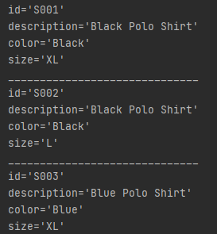
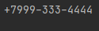
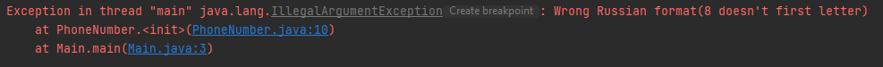

# Отчет по Учебному практическому заданию 3
  
## Задание №1. 

"Разработайте программу формирующую инструкцию SQL, которая
вставляет строки в таблицу T_GroupSelected <id_Student,
firstName, lastName, id_Group> из таблицы
T_Student<id_Student, firstName, lastName, id_Group,
dolgCount > тех студентов, которые относятся к некоторой группе
(строковый параметр) и количество долгов (целочисленный параметр)
которых превышает заданное значение.
В инструкции SQL строковые значения должны обрамляться
одинарными кавычками.
"

### Структура программы:  
* Файл instruction.sql
    * Содержит код sql-запроса

## Задание №2.

"Разработайте класс Person, в котором имеется функция, возвращающая
Фамилию И.О. Функция должна учитывать возможность отсутствия
значений в полях Имя и Отчество. Программу оптимизируйте с точки
зрения быстродействия."  

### Структура программы:  
* Класс Main
    * Тестирование
* Классы Person
    * Содержит 2 конструктора (фамилия являетс обязательной), а так же методы позволяющие устанавливать имя и отчество.
    Метод toString() учитывает возможное отсутствие имени/отчества

### Примеры работы

## Задание №3.
"Доработайте класс адреса, который из полученной строки формата
"Страна[d] Регион[d] Город[d] Улица[d] Дом[d] Корпус[d]
Квартира" ([d] – разделитель, например, «запятая») выбирает
соответствующие части и записывает их в соответствующие поля класса
Address.
Предусмотрите две реализации этого метода:
 * разделитель – только запятая (использовать метод split());
 * разделитель – любой из символов ,.;- (класс StringTokenizer).
Необходимо помнить, что в начале и конце разобранной части адреса не
должно быть пробелов. Все поля адреса строковые.
"
### Структура программы:  
* Класс Main
    * Содержит простейший тестестировщик
* Классы Address
    * Реализованы 2 метода setAddress, с дефолтным разделителем "," в первом случае и 
    произвольным разделителем во втором.

### Примеры работы

## Задание №4.

"Реализуйте класс Shirt:"  

"Метод toString() выводит объяснение и значение полей построчно.
Дан также строковый массив:
 * shirts[0] = "S001,Black Polo Shirt,Black,XL";
 * shirts[1] = "S002,Black Polo Shirt,Black,L";
 * shirts[2] = "S003,Blue Polo Shirt,Blue,XL";
 * shirts[3] = "S004,Blue Polo Shirt,Blue,M";
 * shirts[4] = "S005,Tan Polo Shirt,Tan,XL";
 * shirts[5] = "S006,Black T-Shirt,Black,XL";
 * shirts[6] = "S007,White T-Shirt,White,XL";
 * shirts[7] = "S008,White T-Shirt,White,L";
 * shirts[8] = "S009,Green T-Shirt,Green,S";
 * shirts[9] = "S010,Orange T-Shirt,Orange,S";
 * shirts[10] = "S011,Maroon Polo Shirt,Maroon,S";
Преобразуйте строковый массив в массив класса Shirt и выведите его на
консоль."

### Структура программы:  
* Класс Main
    * Преобразование заданного строкого массива в массив Shirt, вывод в консоль
* Класс Shirt
    
### Примеры работы

## Задание №5.

"Разработайте класс, который получает строковое представление
телефонного номера в одном из двух возможных строковых форматов:
+<Код страны><Номер 10 цифр>, например “+79175655655” или
“+104289652211”
или
8<Номер 10 цифр> для России, например “89175655655”
и преобразует полученную строку в формат:
+<Код страны><Три цифры>–<Три цифры>–<Четыре цифры>"  
 

### Структура программы:  
* Класс Main
    * Тестирование
* Классы PhoneNumer

### Примеры работы

